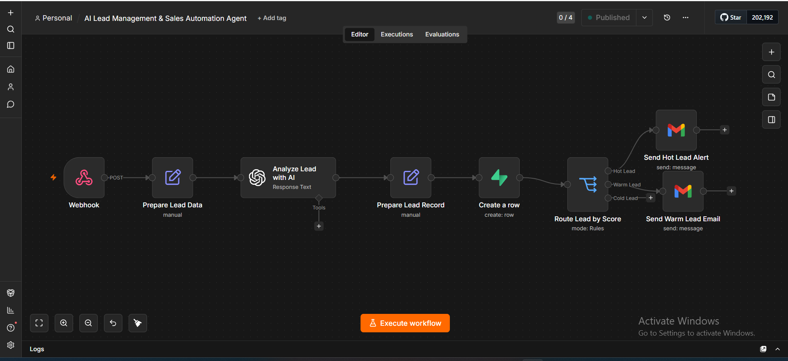
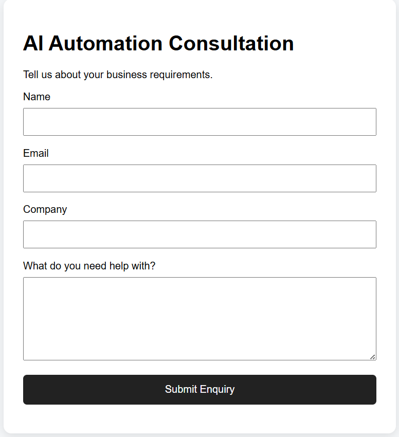
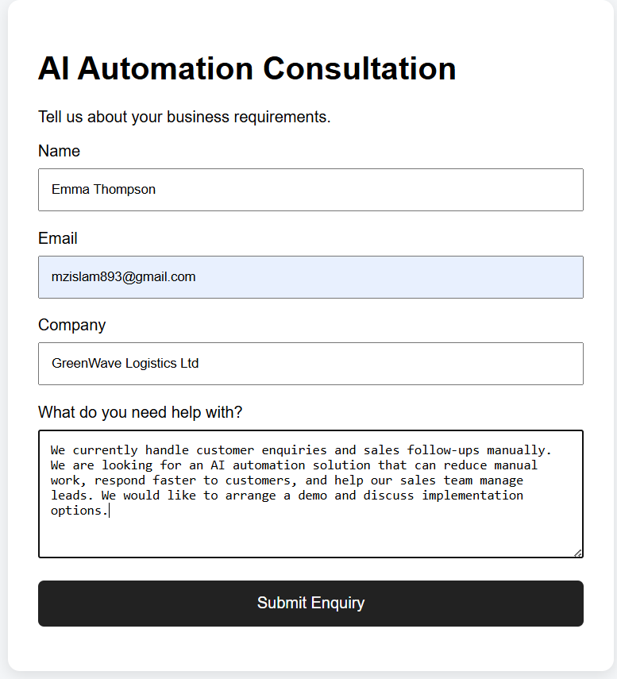
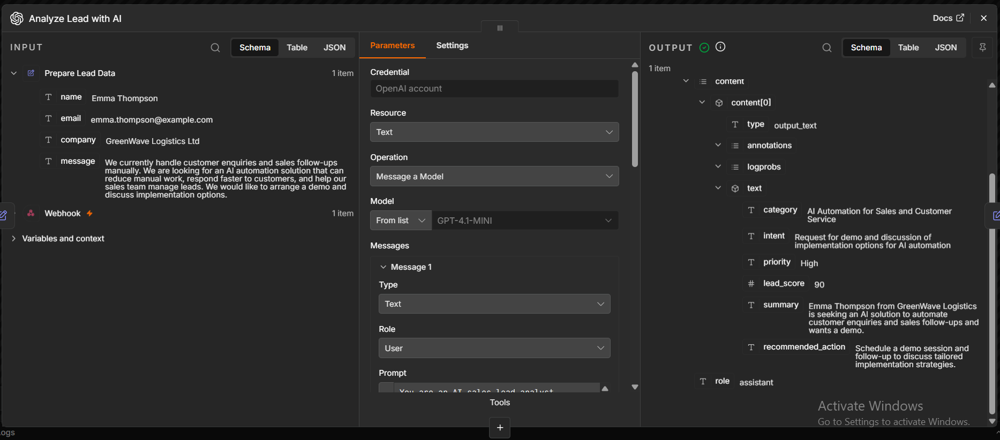
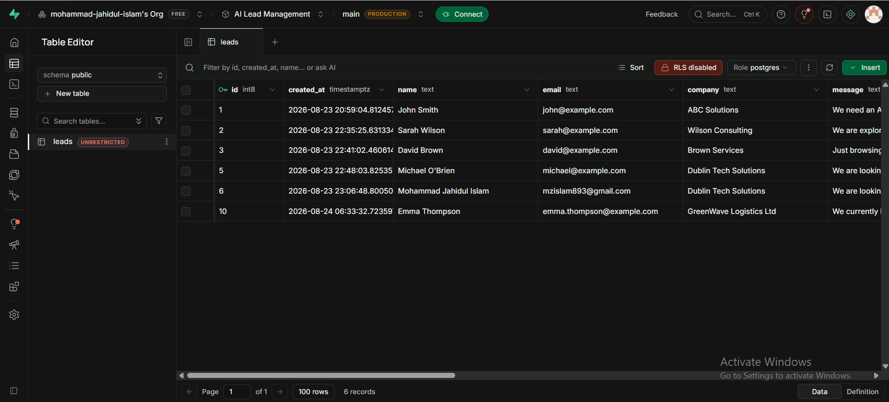
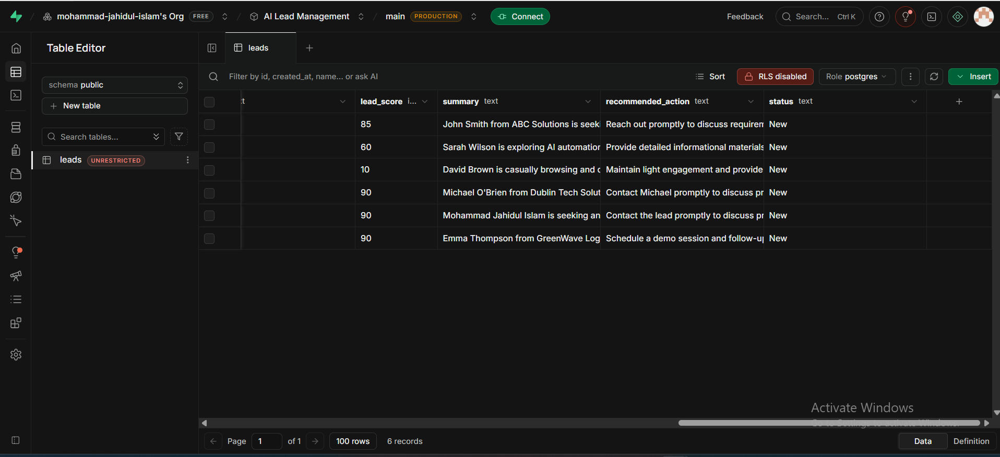
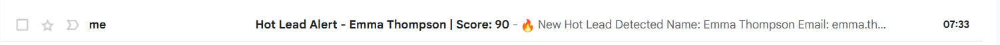

# 🤖 AI Lead Management & Sales Automation

An end-to-end AI-powered lead management and sales automation system built with **n8n, OpenAI, Supabase, Gmail, and a web enquiry form**.

The system automatically receives customer enquiries, analyzes the lead using AI, determines intent and priority, generates a lead score, stores the information in a database, and routes the lead based on its score.

---

## 🚀 Project Overview

Businesses often receive sales enquiries through website forms and manually review each enquiry to determine which leads should receive immediate attention.

This project automates that process.

When a customer submits the enquiry form, the system:

1. Receives the enquiry through an n8n Webhook
2. Prepares and structures the lead data
3. Uses OpenAI to analyze the customer's message
4. Identifies category, intent and priority
5. Generates a lead score
6. Creates an AI summary and recommended action
7. Stores the complete lead record in Supabase
8. Routes the lead based on its score
9. Sends a Gmail alert for high-value leads

---

## 🔄 Workflow Architecture

**Web Form → n8n Webhook → OpenAI Analysis → Supabase → Lead Scoring & Routing → Gmail Alert**



---

## 📝 Customer Enquiry Form

A simple web form collects:

- Name
- Email
- Company
- Business requirements



### Example Lead Submission



After successful submission, the customer receives confirmation.


---

## 🧠 AI Lead Analysis

OpenAI analyzes each customer enquiry and produces structured sales intelligence including:

- Category
- Intent
- Priority
- Lead score
- Summary
- Recommended action



For example, a customer requesting a demo and discussing implementation can be identified as a **high-priority lead** and assigned a high lead score.

---

## 🗄️ Lead Storage with Supabase

The analyzed lead is automatically stored in Supabase.

The database contains both the original customer information and AI-generated sales intelligence.



Additional stored information includes the AI-generated lead score, summary, recommended action and lead status.



---

## 🎯 Automated Lead Routing

After AI analysis, n8n routes leads according to their lead score.

Example routing logic:

- 🔥 **Hot Lead** → Immediate Gmail alert
- 🟡 **Warm Lead** → Follow-up email
- ❄️ **Cold Lead** → Stored for future follow-up

This helps sales teams focus first on the leads with the strongest buying intent.

---

## 📧 Hot Lead Alert

When a high-value lead is detected, the workflow automatically sends a detailed Gmail notification.

The email contains:

- Customer information
- Company
- Category
- Intent
- Priority
- Lead score
- Original customer message
- AI summary
- Recommended action



---

## 🛠️ Technologies Used

| Technology | Purpose |
|---|---|
| n8n | Workflow automation and orchestration |
| OpenAI API | AI lead analysis and scoring |
| Supabase / PostgreSQL | Lead database and storage |
| Gmail | Automated lead notifications |
| Webhook | Receives website form submissions |
| HTML / CSS / JavaScript | Customer enquiry form |
| JSON | Structured AI output and workflow data |

---

## 📊 Example AI Output

A lead can automatically be transformed from an unstructured customer message into structured information such as:

```text
Priority: High
Lead Score: 90/100
Intent: Request for demo and implementation discussion
Status: New
Recommended Action: Schedule a demo session and follow up
